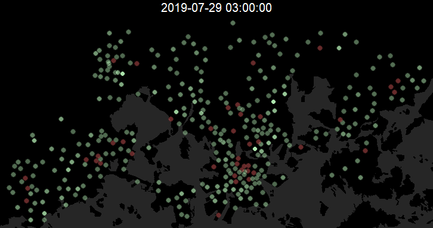

# [HSL citybike station data](https://dev.hsl.fi/citybikes/stations) visualization

Made with R, mostly [tidyverse](https://www.tidyverse.org/) packages plus some [jsonlite](https://github.com/jeroen/jsonlite), [sf](https://github.com/r-spatial/sf), and most importantly, [gganimate](https://gganimate.com).